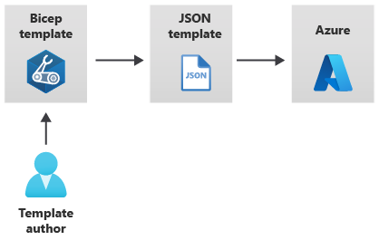

# Azure Bicep
Infrastructure as code is the process of automating your infrastructure provisioning. Bicep is a Resource Manager template language that's used to declaratively deploy Azure resources. This repository can be used to help get started deploying resouces in Bicep.


## Useful Links
* [Microsoft Bicep Documenation](https://docs.microsoft.com/en-us/azure/azure-resource-manager/bicep/)
* [Install Bicep Tools](https://docs.microsoft.com/en-us/azure/azure-resource-manager/bicep/install)
* [MS Learning Modules](https://docs.microsoft.com/en-us/azure/azure-resource-manager/bicep/learn-bicep)
* [Deploy With AZ CLI](https://docs.microsoft.com/en-us/azure/azure-resource-manager/bicep/deploy-cli)
* [Deploy With Powershell](https://docs.microsoft.com/en-us/azure/azure-resource-manager/bicep/deploy-powershell)

## ARM Control Plane
Azure control plan manages requests sent by client interface (Powershell, Azure CLI, RestApi, Or Portal). When the request is sent the Azure Resource Provider takes the request action. The control plane handles what resources need to be created and which already exist. Since the resource manager understands the current environment, it wont create identical resources or delete existing resoruces.


## How Bicep Works
Bicep takes the configuration and converts it to an ARM resource template. ARM is used as an intermediate language used to submit the converted bicep file to the Resource Manager


# Run Bicep using AZ CLI

## Resource Group
``` 
az deployment group create --resource-group <resource-group-name> --template-file <path-to-bicep>
```
## Subscription
```
az deployment sub create --location <location> --template-file <path-to-bicep>
```
## Management Group
```
az deployment mg create --location <location> --template-file <path-to-bicep>
```
# Convert Bicep
## Convert Bicep to ARM 
This will output a ARM Template JSON File from an bicep file. 
```
az bicep build --file main.bicep
```

## Convert ARM to Bicep 
This will take an existing ARM Template and convert it to Bicep. This will attempt to convert but does not guaranteed mapping from ARM template json to bicep. 
[MSFT Documentation](https://docs.microsoft.com/en-us/azure/azure-resource-manager/bicep/decompile?tabs=azure-cli)
```
az bicep decompile --file main.json
```
